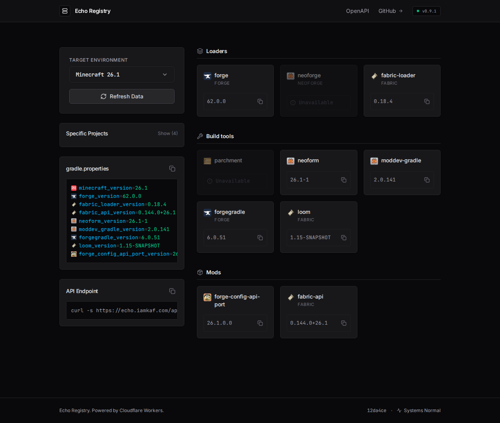

# Echo Registry

Echo Registry provides the latest versions of Forge, NeoForge, Fabric, and popular Minecraft mods through a simple REST API and web interface.

Built to be blazing fast, it runs entirely on **Cloudflare Workers** with **Cloudflare's response cache** for hot-path caching, powered by **Hono** on the backend and **React + Vite** on the frontend.



## Overview

The service exposes up-to-date version data for core mod loaders, popular mods, and development tools.
It’s designed for mod developers and automated build systems that need current dependency versions.

## Supported Dependencies

**Loaders** – Forge, NeoForge, Fabric Loader
**Mods/APIs** – Fabric API, Mod Menu, REI, JEI, Architectury API, Amber, Forge Config API Port
**Dev Tools** – Parchment Mappings, NeoForm, ForgeGradle, ModDev Gradle

## API Endpoints

- `GET /api/health` – Service health and external API connectivity status
- `GET /api/versions/minecraft` – All supported Minecraft versions
- `GET /api/versions/dependencies/{mcVersion}` – Built-in dependencies for a given Minecraft version
- `GET /api/projects/compatibility` – Bulk compatibility checking for custom Modrinth projects

### Examples

```bash
# Get all dependencies for Minecraft 1.21.4
curl https://echo.iamkaf.com/api/versions/dependencies/1.21.4

# Force a fresh dependency response and repopulate the cache
curl -H "X-Echo-Refresh: 1" https://echo.iamkaf.com/api/versions/dependencies/1.21.4

# Check compatibility with multiple projects
curl "https://echo.iamkaf.com/api/projects/compatibility?projects=fabric-api,modmenu&versions=1.21.4"
```

## Development

### Tech Stack

- **Backend:** Cloudflare Workers, Hono
- **Frontend:** React, Vite, Tailwind v4
- **Caching:** Cloudflare response cache (`caches.default`)
- **Tooling:** TypeScript (`tsgo`), Oxlint, Oxfmt

### Requirements

- Node.js 22+
- npm
- Cloudflare account with Workers access

### Setup

```bash
git clone https://github.com/iamkaf/echo-registry
cd echo-registry
npm install
```

1. Start the Vite development server (which emulates the Worker locally):
   ```bash
   npm run dev
   ```
2. Visit [http://localhost:5173](http://localhost:5173) (or whatever port Vite assigns).

### Tooling Commands

- `npm run dev`: Start the local dev server
- `npm run build`: Build the SSR bundle and client SPA
- `npm run typecheck`: Run TSGO type checking
- `npm run lint`: Run Oxlint
- `npm run format`: Format code with Oxfmt

## Configuration

Configuration is managed in `wrangler.jsonc`. Variables available:

- `CACHE_TTL_DEPENDENCIES`: Time (in seconds) to cache dependency responses (default: `1800`).
- `CACHE_TTL_MINECRAFT`: Time (in seconds) to cache the Minecraft manifest response (default: `43200`).
- `CACHE_TTL_COMPATIBILITY`: Time (in seconds) to cache compatibility responses (default: `1800`).

Dependency and compatibility responses are cached by normalized request shape, so query ordering differences do not create separate cache entries.

## Deployment

Deploy directly to Cloudflare Workers:

```bash
npm run deploy
```

## License

MIT License
